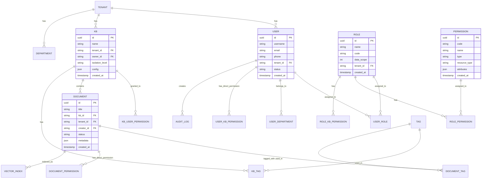
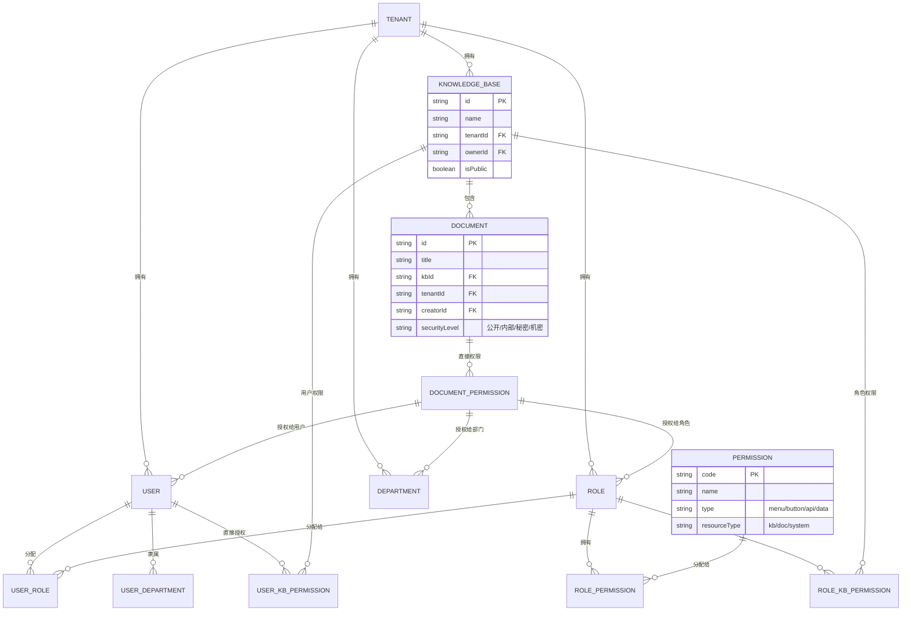
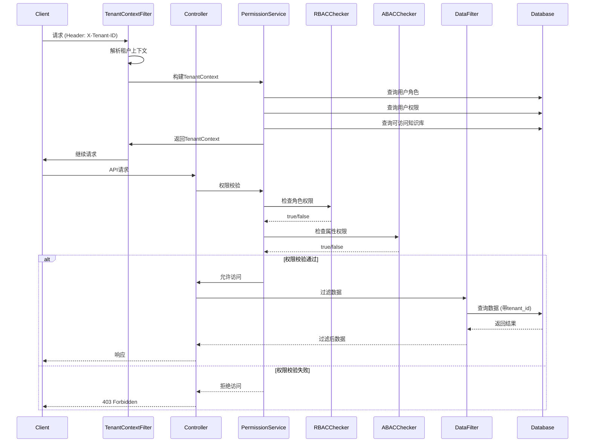

# 企业知识库平台权限体系与数据隔离设计

## 目录

1. [设计概述](#1-设计概述)
2. [权限模型设计](#2-权限模型设计)
3. [数据隔离设计](#3-数据隔离设计)
4. [RAG行级权限设计](#4-rag行级权限设计)
5. [数据库表结构设计](#5-数据库表结构设计)
6. [核心接口设计](#6-核心接口设计)
7. [关键代码示例](#7-关键代码示例)
8. [权限模型ER图](#8-权限模型er图)
9. [实施步骤](#9-实施步骤)
10. [附录：参考实现](#10-附录参考实现)

---

## 1. 设计概述

### 1.1 设计目标

企业知识库平台需要实现：

- **多租户隔离**：确保不同租户（企业/组织）之间的数据完全隔离
- **灵活的权限控制**：支持RBAC+ABAC混合模型，满足复杂业务场景
- **细粒度数据权限**：实现文档级、知识库级、行级的数据访问控制
- **RAG向量化权限**：在向量检索时正确过滤权限，保障数据安全
- **审计追溯能力**：完整的权限变更和访问日志

### 1.2 设计原则

| 原则 | 说明 |
|------|------|
| 最小权限原则 | 用户只能访问必要的数据和功能 |
| 职责分离原则 | 关键操作需要多人授权 |
| 深度防御原则 | 多层安全机制，任何单点失效不影响整体安全 |
| 默认拒绝原则 | 未明确授权的访问一律拒绝 |
| 可审计可追溯原则 | 所有敏感操作需记录日志 |

### 1.3 整体架构

```
┌─────────────────────────────────────────────────────────────────┐
│                         客户端层                                 │
│    Web管理后台 / 知识库搜索门户 / API客户端 / 第三方系统集成      │
└─────────────────────────────────────────────────────────────────┘
                                │
                                ▼
┌─────────────────────────────────────────────────────────────────┐
│                         网关层                                   │
│         JWT认证 / 租户上下文注入 / 流量控制 / 请求路由           │
└─────────────────────────────────────────────────────────────────┘
                                │
                                ▼
┌─────────────────────────────────────────────────────────────────┐
│                       应用服务层                                 │
│  ┌─────────────┐  ┌─────────────┐  ┌─────────────┐             │
│  │  用户服务   │  │  权限服务   │  │  知识库服务 │             │
│  └─────────────┘  └─────────────┘  └─────────────┘             │
│  ┌─────────────┐  ┌─────────────┐  ┌─────────────┐             │
│  │  文档服务   │  │  RAG服务    │  │  审计服务   │             │
│  └─────────────┘  └─────────────┘  └─────────────┘             │
└─────────────────────────────────────────────────────────────────┘
                                │
                    ┌───────────┴───────────┐
                    ▼                       ▼
┌───────────────────────────────┐  ┌───────────────────────────────┐
│        关系型数据库            │  │        向量数据库             │
│   (MySQL/PostgreSQL)          │  │     (Milvus/Qdrant)          │
│   租户逻辑隔离 (Schema级)     │  │   租户集合隔离 (Collection)  │
└───────────────────────────────┘  └───────────────────────────────┘
```

---

## 2. 权限模型设计

### 2.1 混合权限模型架构

采用 **RBAC + ABAC** 混合模型，结合两者优势：

| 模型 | 适用场景 | 特点 |
|------|----------|------|
| RBAC | 常规权限管理 | 角色-权限映射，批量授权，易管理 |
| ABAC | 动态细粒度控制 | 基于属性（时间/部门/文档级别）动态判断 |
| 混合模式 | 企业级应用 | RBAC做框架，ABAC做精细补充 |

### 2.2 权限层级结构

```
┌─────────────────────────────────────────────────────────────┐
│                    系统级权限 (System)                       │
│   系统配置 | 用户管理 | 角色管理 | 审计日志 | 计量计费      │
├─────────────────────────────────────────────────────────────┤
│                    租户级权限 (Tenant)                       │
│   租户配置 | 用户管理 | 部门管理 | 知识库管理 | 角色管理    │
├─────────────────────────────────────────────────────────────┤
│                    知识库级权限 (Knowledge Base)             │
│   创建文档 | 编辑文档 | 删除文档 | 上传文件 | 导出数据      │
├─────────────────────────────────────────────────────────────┤
│                    文档级权限 (Document)                     │
│   查看 | 编辑 | 删除 | 分享 | 批注 | 版本管理               │
├─────────────────────────────────────────────────────────────┤
│                    行级权限 (Row-Level)                      │
│   基于部门/分类/标签/密级等属性过滤数据                     │
└─────────────────────────────────────────────────────────────┘
```

### 2.3 权限标识定义规范

采用 `:code` 分层格式，便于权限管理和代码编写：

```
{模块}:{资源}:{操作}
```

| 模块前缀 | 说明 | 示例 |
|----------|------|------|
| `sys` | 系统管理 | `sys:user:create`, `sys:role:assign` |
| `tenant` | 租户管理 | `tenant:user:invite`, `tenant:dept:manage` |
| `kb` | 知识库管理 | `kb:create`, `kb:config` |
| `doc` | 文档操作 | `doc:read`, `doc:write`, `doc:delete`, `doc:share` |
| `rag` | RAG检索 | `rag:search`, `rag:chat` |

### 2.4 内置角色设计

| 角色标识 | 角色名称 | 权限范围 | 适用对象 |
|----------|----------|----------|----------|
| `system_superadmin` | 超级管理员 | 全系统所有权限 | 平台运营方 |
| `tenant_admin` | 租户管理员 | 租户内所有权限 | 企业IT/管理员 |
| `kb_admin` | 知识库管理员 | 指定知识库所有权限 | 知识库负责人 |
| `editor` | 编辑者 | 文档编辑+创建 | 内容编辑人员 |
| `viewer` | 查看者 | 只读权限 | 普通员工 |
| `guest` | 访客 | 受限查看 | 外部访客/临时用户 |

### 2.5 数据权限范围

| 范围值 | 名称 | 说明 |
|--------|------|------|
| 1 | 全部数据 | 可访问所有数据 |
| 2 | 自定义数据 | 基于自定义规则过滤 |
| 3 | 本部门数据 | 仅限当前用户所属部门 |
| 4 | 本部门及下级 | 当前部门及所有子部门 |
| 5 | 仅本人数据 | 仅可访问自己的数据 |
| 6 | 标签过滤 | 基于文档标签属性过滤 |

---

## 3. 数据隔离设计

### 3.1 多租户隔离策略

采用 **混合隔离模式**，根据租户级别动态选择隔离强度：

| 租户级别 | 隔离模式 | 说明 |
|----------|----------|------|
| 免费版 | 共享数据库+Schema | 多租户共享，Schema隔离 |
| 标准版 | 独立Schema | 每个租户独立Schema |
| 企业版 | 独立数据库 | 完全物理隔离 |
| 旗舰版 | 独立部署 | 独立实例+独立向量库 |

### 3.2 租户隔离架构

```
┌─────────────────────────────────────────────────────────────────┐
│                     应用实例层 (共享)                            │
│                  Spring Boot 微服务集群                          │
└─────────────────────────────────────────────────────────────────┘
                                │
                                ▼
┌─────────────────────────────────────────────────────────────────┐
│                      数据库隔离层                                │
├─────────────┬─────────────┬─────────────┬─────────────┬────────┤
│  Schema A   │  Schema B   │  Schema C   │  Schema N   │ ...    │
│  (租户A)    │  (租户B)    │  (租户C)    │  (租户N)    │        │
│  ┌────────┐ │  ┌────────┐ │  ┌────────┐ │  ┌────────┐ │        │
│  │用户表  │ │  │用户表  │ │  │用户表  │ │  │用户表  │ │        │
│  │角色表  │ │  │角色表  │ │  │角色表  │ │  │角色表  │ │        │
│  │知识库表│ │  │知识库表│ │  │知识库表│ │  │知识库表│ │        │
│  │文档表  │ │  │文档表  │ │  │文档表  │ │  │文档表  │ │        │
│  │向量映射│ │  │向量映射│ │  │向量映射│ │  │向量映射│ │        │
│  └────────┘ │  └────────┘ │  └────────┘ │  └────────┘ │        │
└─────────────┴─────────────┴─────────────┴─────────────┴────────┘
                                │
                                ▼
┌─────────────────────────────────────────────────────────────────┐
│                      向量数据库隔离层                             │
├─────────────┬─────────────┬─────────────┬─────────────┬────────┤
│Collection A │Collection B │Collection C │Collection N │ ...    │
│  (租户A)    │  (租户B)    │  (租户C)    │  (租户N)    │        │
│  独立索引   │  独立索引   │  独立索引   │  独立索引   │        │
└─────────────┴─────────────┴─────────────┴─────────────┴────────┘
```

### 3.3 租户上下文传递

```
┌─────────────────────────────────────────────────────────────────┐
│                        请求携带租户ID                            │
│                        Header: X-Tenant-ID                       │
└─────────────────────────────────────────────────────────────────┘
                                │
                                ▼
┌─────────────────────────────────────────────────────────────────┐
│                      租户上下文过滤器                            │
│              TenantContextFilter (Servlet Filter)               │
│                    解析并存储租户上下文                          │
└─────────────────────────────────────────────────────────────────┘
                                │
                                ▼
┌─────────────────────────────────────────────────────────────────┐
│                      ThreadLocal存储                            │
│              TenantContextHolder.getCurrentTenant()             │
└─────────────────────────────────────────────────────────────────┘
                                │
                                ▼
┌─────────────────────────────────────────────────────────────────┐
│                      动态数据源路由                              │
│         TenantRoutingDataSource / MyBatis TenantInterceptor     │
│                    自动注入 tenant_id 条件                      │
└─────────────────────────────────────────────────────────────────┘
```

### 3.4 知识库隔离策略

| 隔离维度 | 实现方式 | 说明 |
|----------|----------|------|
| 知识库列表 | 租户ID过滤 | 用户只能看到自己租户的知识库 |
| 文档存储 | 租户+知识库ID | 每篇文档关联租户ID和知识库ID |
| 向量索引 | 独立Collection | 每个知识库独立向量集合 |
| 搜索结果 | 租户+权限过滤 | 检索时自动附加权限条件 |
| 共享文档 | 显式授权 | 跨知识库共享需明确授权 |

### 3.5 对话历史隔离

```
┌─────────────────────────────────────────────────────────────────┐
│                     对话会话隔离                                 │
├─────────────────────────────────────────────────────────────────┤
│  用户A的对话 ←→ 用户A的租户 ←→ 用户A有权限的知识库              │
├─────────────────────────────────────────────────────────────────┤
│  隔离维度：                                                     │
│  1. tenant_id: 租户隔离，确保不同企业数据不互通                  │
│  2. user_id: 用户隔离，确保同一租户内用户独立                   │
│  3. kb_ids: 知识库隔离，基于用户权限过滤可访问的对话上下文        │
│  4. doc_ids: 文档级隔离，限制对话中引用的具体文档                │
└─────────────────────────────────────────────────────────────────┘
```

---

## 4. RAG行级权限设计

### 4.1 向量检索权限过滤架构

```
┌─────────────────────────────────────────────────────────────────┐
│                        用户查询请求                              │
│                      query: "xxx", top_k: 10                    │
└─────────────────────────────────────────────────────────────────┘
                                │
                                ▼
┌─────────────────────────────────────────────────────────────────┐
│                      权限解析层                                   │
│  1. 获取用户身份和租户上下文                                    │
│  2. 查询用户角色和权限列表                                      │
│  3. 构建权限过滤条件                                             │
└─────────────────────────────────────────────────────────────────┘
                                │
                                ▼
┌─────────────────────────────────────────────────────────────────┐
│                      元数据标签构建                              │
│  tenant_id: "tenant_001"          (必须)                       │
│  department_ids: ["dept_001", "dept_002"]  (部门)               │
│  security_level: ["内部", "秘密"]        (密级)                 │
│  kb_ids: ["kb_001", "kb_002"]          (知识库)                 │
│  tag_ids: ["tag_001", "tag_002"]        (标签)                  │
│  creator_id: "user_001"                 (创建者)                │
└─────────────────────────────────────────────────────────────────┘
                                │
                                ▼
┌─────────────────────────────────────────────────────────────────┐
│                      向量检索执行                                │
│  search(                                                          │
│    collection="knowledge_base_001",  // 租户级Collection        │
│    vector=[...],                                                 │
│    filter=metadata_filter,  // 元数据过滤条件                   │
│    top_k=10                                                       │
│  )                                                                │
└─────────────────────────────────────────────────────────────────┘
                                │
                                ▼
┌─────────────────────────────────────────────────────────────────┐
│                      结果后处理                                  │
│  1. 二次权限验证（防止元数据篡改）                               │
│  2. 敏感信息脱敏                                                 │
│  3. 引用来源标记                                                 │
└─────────────────────────────────────────────────────────────────┘
```

### 4.2 元数据标签设计

```json
{
  // 必选：租户标识（最高优先级）
  "tenant_id": "tenant_001",
  
  // 必选：知识库标识
  "kb_id": "kb_001",
  
  // 部门维度
  "department_ids": ["dept_001", "dept_002"],
  
  // 密级维度
  "security_level": "机密",
  
  // 标签维度（灵活扩展）
  "tags": ["技术文档", "财务数据", "人事信息"],
  
  // 创建者维度
  "creator_id": "user_001",
  
  // 创建时间（用于时间范围过滤）
  "created_at": "2024-01-15T10:30:00Z",
  
  // 文档状态
  "status": "published",
  
  // 自定义扩展字段
  "custom_fields": {
    "project_code": "PRJ2024001",
    "region": "华东"
  }
}
```

### 4.3 权限过滤查询构造

```python
# 向量检索权限过滤示例 (Milvus/Qdrant风格)

def build_permission_filter(user_context: UserContext, doc_type: str = None) -> dict:
    """构建权限过滤条件"""
    
    # 基础条件：必须属于当前租户
    conditions = [
        {"field": "tenant_id", "operator": "==", "value": user_context.tenant_id}
    ]
    
    # 知识库权限过滤
    if user_context.allowed_kb_ids:
        conditions.append({
            "field": "kb_id", 
            "operator": "in", 
            "value": user_context.allowed_kb_ids
        })
    
    # 部门权限过滤
    if user_context.allowed_department_ids:
        conditions.append({
            "field": "department_ids",
            "operator": "in",
            "value": user_context.allowed_department_ids
        })
    
    # 密级权限过滤
    if user_context.max_security_level:
        allowed_levels = get_allowed_security_levels(user_context.max_security_level)
        conditions.append({
            "field": "security_level",
            "operator": "in",
            "value": allowed_levels
        })
    
    # 标签权限过滤
    if user_context.allowed_tags:
        conditions.append({
            "field": "tags",
            "operator": "contains_any",
            "value": user_context.allowed_tags
        })
    
    # 文档状态过滤（仅查询已发布文档）
    conditions.append({
        "field": "status",
        "operator": "==",
        "value": "published"
    })
    
    # 组合过滤条件
    return {
        "operator": "AND",
        "conditions": conditions
    }
```

### 4.4 性能优化策略

| 策略 | 说明 | 适用场景 |
|------|------|----------|
| 租户级Collection | 每个租户独立向量集合 | 大规模部署，避免跨租户检索 |
| 预过滤索引 | 对tenant_id建立分区索引 | 千万级向量数据 |
| 分层过滤 | 先租户→再部门→再标签 | 复杂权限结构 |
| 缓存权限结果 | Redis缓存用户权限列表 | 减少权限查询开销 |
| 异步权限校验 | 检索完成后异步校验 | 高并发场景 |
| 近似最近邻优化 | HNSW/IVF索引调优 | 平衡精度与性能 |

---

## 5. 数据库表结构设计

### 5.1 ER图



### 5.2 核心表结构

#### 5.2.1 租户表 (sys_tenant)

```sql
CREATE TABLE sys_tenant (
    id VARCHAR(64) NOT NULL COMMENT '租户ID',
    name VARCHAR(128) NOT NULL COMMENT '租户名称',
    code VARCHAR(64) NOT NULL UNIQUE COMMENT '租户编码',
    isolation_level TINYINT DEFAULT 1 COMMENT '隔离级别:1-逻辑,2-Schema,3-数据库',
    status TINYINT DEFAULT 1 COMMENT '状态:0-禁用,1-正常',
    expire_time DATETIME COMMENT '过期时间',
    max_users INT DEFAULT 100 COMMENT '最大用户数',
    max_kb_count INT DEFAULT 50 COMMENT '最大知识库数',
    max_storage_bytes BIGINT DEFAULT 10737418240 COMMENT '最大存储(字节)',
    config JSON COMMENT '租户配置',
    created_at DATETIME DEFAULT CURRENT_TIMESTAMP,
    updated_at DATETIME DEFAULT CURRENT_TIMESTAMP ON UPDATE CURRENT_TIMESTAMP,
    PRIMARY KEY (id),
    KEY idx_code (code),
    KEY idx_status (status)
) ENGINE=InnoDB DEFAULT CHARSET=utf8mb4 COMMENT='租户表';
```

#### 5.2.2 用户表 (sys_user)

```sql
CREATE TABLE sys_user (
    id VARCHAR(64) NOT NULL COMMENT '用户ID',
    username VARCHAR(64) NOT NULL COMMENT '用户名',
    password VARCHAR(128) NOT NULL COMMENT '密码(加密)',
    real_name VARCHAR(64) COMMENT '真实姓名',
    email VARCHAR(128) COMMENT '邮箱',
    phone VARCHAR(20) COMMENT '手机号',
    avatar VARCHAR(512) COMMENT '头像URL',
    tenant_id VARCHAR(64) NOT NULL COMMENT '所属租户ID',
    dept_id VARCHAR(64) COMMENT '所属部门ID',
    status TINYINT DEFAULT 1 COMMENT '状态:0-禁用,1-正常',
    login_ip VARCHAR(128) COMMENT '最后登录IP',
    login_date DATETIME COMMENT '最后登录时间',
    create_by VARCHAR(64) COMMENT '创建者',
    create_time DATETIME DEFAULT CURRENT_TIMESTAMP,
    update_by VARCHAR(64) COMMENT '更新者',
    update_time DATETIME DEFAULT CURRENT_TIMESTAMP ON UPDATE CURRENT_TIMESTAMP,
    PRIMARY KEY (id),
    UNIQUE KEY uk_tenant_username (tenant_id, username),
    KEY idx_tenant_id (tenant_id),
    KEY idx_dept_id (dept_id),
    KEY idx_email (email),
    KEY idx_phone (phone)
) ENGINE=InnoDB DEFAULT CHARSET=utf8mb4 COMMENT='用户表';
```

#### 5.2.3 角色表 (sys_role)

```sql
CREATE TABLE sys_role (
    id VARCHAR(64) NOT NULL COMMENT '角色ID',
    role_name VARCHAR(64) NOT NULL COMMENT '角色名称',
    role_key VARCHAR(64) NOT NULL COMMENT '角色标识',
    role_sort INT DEFAULT 0 COMMENT '显示顺序',
    data_scope TINYINT DEFAULT 5 COMMENT '数据权限范围:1-全部,2-自定义,3-本部门,4-本部门及下级,5-仅本人',
    data_scope_depts TEXT COMMENT '自定义数据权限部门IDs',
    status TINYINT DEFAULT 1 COMMENT '状态:0-禁用,1-正常',
    is_default TINYINT DEFAULT 0 COMMENT '是否为默认角色:0-否,1-是',
    tenant_id VARCHAR(64) NOT NULL COMMENT '所属租户ID',
    remark VARCHAR(512) COMMENT '备注',
    create_by VARCHAR(64) COMMENT '创建者',
    create_time DATETIME DEFAULT CURRENT_TIMESTAMP,
    update_by VARCHAR(64) COMMENT '更新者',
    update_time DATETIME DEFAULT CURRENT_TIMESTAMP ON UPDATE CURRENT_TIMESTAMP,
    PRIMARY KEY (id),
    UNIQUE KEY uk_tenant_role_key (tenant_id, role_key),
    KEY idx_tenant_id (tenant_id),
    KEY idx_status (status)
) ENGINE=InnoDB DEFAULT CHARSET=utf8mb4 COMMENT='角色表';
```

#### 5.2.4 权限表 (sys_permission)

```sql
CREATE TABLE sys_permission (
    id VARCHAR(64) NOT NULL COMMENT '权限ID',
    permission_code VARCHAR(128) NOT NULL COMMENT '权限标识',
    permission_name VARCHAR(64) NOT NULL COMMENT '权限名称',
    permission_type VARCHAR(32) NOT NULL COMMENT '权限类型:menu,button,api,data',
    resource_type VARCHAR(32) COMMENT '资源类型:kb,doc,system',
    parent_id VARCHAR(64) COMMENT '父权限ID',
    order_num INT DEFAULT 0 COMMENT '排序号',
    path VARCHAR(256) COMMENT '路由路径',
    component VARCHAR(256) COMMENT '组件路径',
    component_name VARCHAR(128) COMMENT '组件名称',
    is_visible TINYINT DEFAULT 1 COMMENT '是否显示菜单:0-否,1-是',
    is_cache TINYINT DEFAULT 0 COMMENT '是否缓存:0-否,1-是',
    status TINYINT DEFAULT 1 COMMENT '状态:0-禁用,1-正常',
    attrs JSON COMMENT '扩展属性',
    create_by VARCHAR(64) COMMENT '创建者',
    create_time DATETIME DEFAULT CURRENT_TIMESTAMP,
    update_by VARCHAR(64) COMMENT '更新者',
    update_time DATETIME DEFAULT CURRENT_TIMESTAMP ON UPDATE CURRENT_TIMESTAMP,
    PRIMARY KEY (id),
    UNIQUE KEY uk_permission_code (permission_code),
    KEY idx_parent_id (parent_id),
    KEY idx_resource_type (resource_type),
    KEY idx_permission_type (permission_type)
) ENGINE=InnoDB DEFAULT CHARSET=utf8mb4 COMMENT='权限表';
```

#### 5.2.5 用户-角色关联表 (sys_user_role)

```sql
CREATE TABLE sys_user_role (
    user_id VARCHAR(64) NOT NULL COMMENT '用户ID',
    role_id VARCHAR(64) NOT NULL COMMENT '角色ID',
    tenant_id VARCHAR(64) NOT NULL COMMENT '租户ID',
    create_time DATETIME DEFAULT CURRENT_TIMESTAMP,
    PRIMARY KEY (user_id, role_id),
    KEY idx_role_id (role_id),
    KEY idx_tenant_id (tenant_id)
) ENGINE=InnoDB DEFAULT CHARSET=utf8mb4 COMMENT='用户和角色关联表';
```

#### 5.2.6 角色-权限关联表 (sys_role_permission)

```sql
CREATE TABLE sys_role_permission (
    role_id VARCHAR(64) NOT NULL COMMENT '角色ID',
    permission_id VARCHAR(64) NOT NULL COMMENT '权限ID',
    create_time DATETIME DEFAULT CURRENT_TIMESTAMP,
    PRIMARY KEY (role_id, permission_id),
    KEY idx_permission_id (permission_id)
) ENGINE=InnoDB DEFAULT CHARSET=utf8mb4 COMMENT='角色和权限关联表';
```

#### 5.2.7 知识库表 (kb_knowledge_base)

```sql
CREATE TABLE kb_knowledge_base (
    id VARCHAR(64) NOT NULL COMMENT '知识库ID',
    name VARCHAR(128) NOT NULL COMMENT '知识库名称',
    description TEXT COMMENT '知识库描述',
    tenant_id VARCHAR(64) NOT NULL COMMENT '所属租户ID',
    owner_id VARCHAR(64) COMMENT '负责人ID',
    embedding_model VARCHAR(64) COMMENT '向量化模型',
    vector_dimension INT DEFAULT 1536 COMMENT '向量维度',
    status TINYINT DEFAULT 1 COMMENT '状态:0-禁用,1-正常',
    is_public TINYINT DEFAULT 0 COMMENT '是否公共知识库:0-否,1-是',
    config JSON COMMENT '配置信息',
    storage_path VARCHAR(512) COMMENT '存储路径',
    chunk_size INT DEFAULT 512 COMMENT '分块大小',
    overlap_size INT DEFAULT 50 COMMENT '重叠大小',
    created_at DATETIME DEFAULT CURRENT_TIMESTAMP,
    updated_at DATETIME DEFAULT CURRENT_TIMESTAMP ON UPDATE CURRENT_TIMESTAMP,
    PRIMARY KEY (id),
    KEY idx_tenant_id (tenant_id),
    KEY idx_owner_id (owner_id),
    KEY idx_status (status)
) ENGINE=InnoDB DEFAULT CHARSET=utf8mb4 COMMENT='知识库表';
```

#### 5.2.8 文档表 (kb_document)

```sql
CREATE TABLE kb_document (
    id VARCHAR(64) NOT NULL COMMENT '文档ID',
    title VARCHAR(256) NOT NULL COMMENT '文档标题',
    content TEXT COMMENT '文档内容',
    kb_id VARCHAR(64) NOT NULL COMMENT '所属知识库ID',
    tenant_id VARCHAR(64) NOT NULL COMMENT '所属租户ID',
    creator_id VARCHAR(64) NOT NULL COMMENT '创建者ID',
    dept_id VARCHAR(64) COMMENT '所属部门ID',
    security_level VARCHAR(32) DEFAULT '内部' COMMENT '密级:公开,内部,秘密,机密',
    status TINYINT DEFAULT 1 COMMENT '状态:0-草稿,1-已发布,2-已归档',
    file_type VARCHAR(32) COMMENT '文件类型',
    file_size BIGINT COMMENT '文件大小',
    file_path VARCHAR(512) COMMENT '文件路径',
    vector_ids TEXT COMMENT '向量ID列表(JSON)',
    chunk_count INT DEFAULT 0 COMMENT '分块数量',
    metadata JSON COMMENT '元数据',
    tags VARCHAR(512) COMMENT '标签(JSON数组)',
    version INT DEFAULT 1 COMMENT '版本号',
    parent_id VARCHAR(64) COMMENT '父文档ID',
    created_at DATETIME DEFAULT CURRENT_TIMESTAMP,
    updated_at DATETIME DEFAULT CURRENT_TIMESTAMP ON UPDATE CURRENT_TIMESTAMP,
    PRIMARY KEY (id),
    KEY idx_kb_id (kb_id),
    KEY idx_tenant_id (tenant_id),
    KEY idx_creator_id (creator_id),
    KEY idx_dept_id (dept_id),
    KEY idx_status (status),
    KEY idx_security_level (security_level),
    KEY idx_created_at (created_at)
) ENGINE=InnoDB DEFAULT CHARSET=utf8mb4 COMMENT='文档表';
```

#### 5.2.9 文档权限表 (kb_document_permission)

```sql
CREATE TABLE kb_document_permission (
    id VARCHAR(64) NOT NULL COMMENT '权限ID',
    doc_id VARCHAR(64) NOT NULL COMMENT '文档ID',
    tenant_id VARCHAR(64) NOT NULL COMMENT '租户ID',
    permission_type VARCHAR(32) NOT NULL COMMENT '权限类型:user,role,dept,all',
    target_id VARCHAR(64) COMMENT '目标ID(用户/角色/部门ID)',
    permission_level VARCHAR(32) NOT NULL COMMENT '权限级别:read,write,manage,share',
    expire_time DATETIME COMMENT '过期时间',
    created_by VARCHAR(64) COMMENT '创建者',
    created_at DATETIME DEFAULT CURRENT_TIMESTAMP,
    PRIMARY KEY (id),
    KEY idx_doc_id (doc_id),
    KEY idx_tenant_id (tenant_id),
    KEY idx_target_id (target_id),
    KEY idx_permission_type (permission_type)
) ENGINE=InnoDB DEFAULT CHARSET=utf8mb4 COMMENT='文档权限表';
```

#### 5.2.10 审计日志表 (sys_audit_log)

```sql
CREATE TABLE sys_audit_log (
    id VARCHAR(64) NOT NULL COMMENT '日志ID',
    tenant_id VARCHAR(64) NOT NULL COMMENT '租户ID',
    user_id VARCHAR(64) COMMENT '操作用户ID',
    username VARCHAR(64) COMMENT '操作用户名',
    operation VARCHAR(64) NOT NULL COMMENT '操作类型',
    resource_type VARCHAR(64) COMMENT '资源类型',
    resource_id VARCHAR(64) COMMENT '资源ID',
    resource_name VARCHAR(256) COMMENT '资源名称',
    request_method VARCHAR(10) COMMENT '请求方法',
    request_url VARCHAR(512) COMMENT '请求URL',
    request_params TEXT COMMENT '请求参数',
    request_ip VARCHAR(128) COMMENT '请求IP',
    user_agent VARCHAR(512) COMMENT 'User-Agent',
    status TINYINT DEFAULT 1 COMMENT '状态:0-失败,1-成功',
    error_msg TEXT COMMENT '错误信息',
    execution_time INT COMMENT '执行时间(毫秒)',
    created_at DATETIME DEFAULT CURRENT_TIMESTAMP,
    PRIMARY KEY (id),
    KEY idx_tenant_id (tenant_id),
    KEY idx_user_id (user_id),
    KEY idx_operation (operation),
    KEY idx_resource_type (resource_type),
    KEY idx_created_at (created_at)
) ENGINE=InnoDB DEFAULT CHARSET=utf8mb4 COMMENT='审计日志表';
```

---

## 6. 核心接口设计

### 6.1 权限管理接口

| 接口 | 方法 | 路径 | 说明 |
|------|------|------|------|
| 获取用户权限 | GET | `/api/v1/permissions/user` | 获取当前用户的权限列表 |
| 获取角色权限 | GET | `/api/v1/roles/{roleId}/permissions` | 获取角色的权限列表 |
| 分配角色权限 | POST | `/api/v1/roles/{roleId}/permissions` | 为角色分配权限 |
| 批量分配权限 | POST | `/api/v1/permissions/batch-assign` | 批量分配权限 |

### 6.2 知识库权限接口

| 接口 | 方法 | 路径 | 说明 |
|------|------|------|------|
| 获取知识库权限 | GET | `/api/v1/kb/{kbId}/permissions` | 获取知识库权限列表 |
| 设置知识库权限 | POST | `/api/v1/kb/{kbId}/permissions` | 设置知识库权限 |
| 移除知识库权限 | DELETE | `/api/v1/kb/{kbId}/permissions/{permissionId}` | 移除权限 |
| 获取可访问知识库 | GET | `/api/v1/kb/accessible` | 获取用户可访问的知识库 |

### 6.3 文档权限接口

| 接口 | 方法 | 路径 | 说明 |
|------|------|------|------|
| 获取文档权限 | GET | `/api/v1/doc/{docId}/permissions` | 获取文档权限列表 |
| 设置文档权限 | POST | `/api/v1/doc/{docId}/permissions` | 设置文档权限 |
| 分享文档 | POST | `/api/v1/doc/{docId}/share` | 分享文档给其他用户 |
| 批量设置权限 | POST | `/api/v1/doc/batch-permissions` | 批量设置文档权限 |

### 6.4 RAG检索接口

| 接口 | 方法 | 路径 | 说明 |
|------|------|------|------|
| 向量检索 | POST | `/api/v1/rag/search` | 执行权限过滤的向量检索 |
| 对话检索 | POST | `/api/v1/rag/chat` | 执行对话式RAG检索 |

---

## 7. 关键代码示例

### 7.1 租户上下文持有者

```java
package com.enterprise.knowledge.security;

import lombok.Data;

/**
 * 租户上下文信息
 */
@Data
public class TenantContext {
    private String tenantId;
    private String userId;
    private String username;
    private String deptId;
    private List<String> roleIds;
    private List<String> roleKeys;
    private List<String> permissionCodes;
    private List<String> allowedKbIds;
    private List<String> allowedDeptIds;
    private String maxSecurityLevel;
    private Integer dataScope;
}
```

```java
package com.enterprise.knowledge.security;

import com.enterprise.knowledge.entity.TenantContext;
import lombok.extern.slf4j.Slf4j;

/**
 * 租户上下文持有者（ThreadLocal存储）
 */
@Slf4j
public class TenantContextHolder {
    
    private static final ThreadLocal<TenantContext> CONTEXT = new ThreadLocal<>();
    
    public static void setContext(TenantContext context) {
        CONTEXT.set(context);
    }
    
    public static TenantContext getContext() {
        return CONTEXT.get();
    }
    
    public static String getTenantId() {
        TenantContext context = getContext();
        return context != null ? context.getTenantId() : null;
    }
    
    public static String getUserId() {
        TenantContext context = getContext();
        return context != null ? context.getUserId() : null;
    }
    
    public static List<String> getAllowedKbIds() {
        TenantContext context = getContext();
        return context != null ? context.getAllowedKbIds() : Collections.emptyList();
    }
    
    public static void clear() {
        CONTEXT.remove();
    }
}
```

### 7.2 租户上下文过滤器

```java
package com.enterprise.knowledge.filter;

import com.enterprise.knowledge.security.TenantContext;
import com.enterprise.knowledge.security.TenantContextHolder;
import com.enterprise.knowledge.security.UserPermissionService;
import com.enterprise.knowledge.util.JwtUtil;
import lombok.RequiredArgsConstructor;
import lombok.extern.slf4j.Slf4j;
import org.springframework.stereotype.Component;
import org.springframework.web.filter.OncePerRequestFilter;

import javax.servlet.FilterChain;
import javax.servlet.ServletException;
import javax.servlet.http.HttpServletRequest;
import javax.servlet.http.HttpServletResponse;
import java.io.IOException;
import java.util.List;

/**
 * 租户上下文过滤器 - 从请求中提取租户ID并构建上下文
 */
@Slf4j
@Component
@RequiredArgsConstructor
public class TenantContextFilter extends OncePerRequestFilter {
    
    private static final String TENANT_HEADER = "X-Tenant-ID";
    private static final String TOKEN_HEADER = "Authorization";
    private static final String TOKEN_PREFIX = "Bearer ";
    
    private final UserPermissionService userPermissionService;
    
    @Override
    protected void doFilterInternal(HttpServletRequest request, 
                                    HttpServletResponse response, 
                                    FilterChain filterChain) throws ServletException, IOException {
        try {
            // 1. 获取租户ID
            String tenantId = request.getHeader(TENANT_HEADER);
            
            // 2. 从JWT获取用户信息
            String token = request.getHeader(TOKEN_HEADER);
            if (token != null && token.startsWith(TOKEN_PREFIX)) {
                token = token.substring(TOKEN_PREFIX.length());
                String userId = JwtUtil.getUserIdFromToken(token);
                
                // 3. 构建租户上下文
                TenantContext context = userPermissionService.buildTenantContext(tenantId, userId);
                TenantContextHolder.setContext(context);
                
                // 4. 设置租户数据源路由
                TenantDataSourceHolder.setCurrentTenant(tenantId);
            }
            
            filterChain.doFilter(request, response);
        } finally {
            // 清理上下文，防止内存泄漏
            TenantContextHolder.clear();
            TenantDataSourceHolder.clear();
        }
    }
    
    @Override
    protected boolean shouldNotFilter(HttpServletRequest request) {
        String path = request.getRequestURI();
        // 放行登录、注册等公开接口
        return path.startsWith("/api/v1/auth/login") 
            || path.startsWith("/api/v1/public");
    }
}
```

### 7.3 权限服务

```java
package com.enterprise.knowledge.security;

import com.enterprise.knowledge.entity.SysUser;
import com.enterprise.knowledge.entity.SysRole;
import lombok.RequiredArgsConstructor;
import lombok.extern.slf4j.Slf4j;
import org.springframework.stereotype.Service;

import java.util.*;
import java.util.stream.Collectors;

/**
 * 用户权限服务
 */
@Slf4j
@Service
@RequiredArgsConstructor
public class UserPermissionService {
    
    private final UserMapper userMapper;
    private final RoleMapper roleMapper;
    private final PermissionMapper permissionMapper;
    private final RolePermissionMapper rolePermissionMapper;
    private final UserRoleMapper userRoleMapper;
    
    /**
     * 构建租户上下文
     */
    public TenantContext buildTenantContext(String tenantId, String userId) {
        TenantContext context = new TenantContext();
        context.setTenantId(tenantId);
        context.setUserId(userId);
        
        // 查询用户信息
        SysUser user = userMapper.selectById(userId);
        if (user != null) {
            context.setUsername(user.getUsername());
            context.setDeptId(user.getDeptId());
        }
        
        // 查询用户角色
        List<SysRole> roles = roleMapper.selectByUserId(userId);
        List<String> roleIds = roles.stream().map(SysRole::getId).collect(Collectors.toList());
        List<String> roleKeys = roles.stream().map(SysRole::getRoleKey).collect(Collectors.toList());
        context.setRoleIds(roleIds);
        context.setRoleKeys(roleKeys);
        
        // 合并数据权限范围
        Integer maxDataScope = roles.stream()
                .map(SysRole::getDataScope)
                .max(Integer::compareTo)
                .orElse(5);
        context.setDataScope(maxDataScope);
        
        // 查询用户权限
        List<String> permissionCodes = permissionMapper.selectByUserId(userId);
        context.setPermissionCodes(permissionCodes);
        
        // 构建知识库权限
        List<String> allowedKbIds = buildAllowedKbIds(tenantId, userId, roleIds, maxDataScope);
        context.setAllowedKbIds(allowedKbIds);
        
        // 构建部门权限
        List<String> allowedDeptIds = buildAllowedDeptIds(tenantId, userId, roles);
        context.setAllowedDeptIds(allowedDeptIds);
        
        // 构建密级权限
        context.setMaxSecurityLevel("机密");
        
        return context;
    }
    
    /**
     * 构建用户可访问的知识库列表
     */
    private List<String> buildAllowedKbIds(String tenantId, String userId, 
                                           List<String> roleIds, Integer dataScope) {
        List<String> allowedKbIds = new ArrayList<>();
        
        // 管理员和知识库管理员可访问所有知识库
        if (roleIds.contains("admin") || roleIds.contains("kb_admin")) {
            return Collections.emptyList(); // 空表示全部
        }
        
        // 基于数据范围构建权限
        switch (dataScope) {
            case 1: // 全部数据
                return Collections.emptyList();
            case 5: // 仅本人
                allowedKbIds.addAll(getPersonalKbIds(userId));
                break;
            default:
                allowedKbIds.addAll(getKbIdsByDept(tenantId, userId));
                allowedKbIds.addAll(getDirectlyAssignedKbIds(userId));
        }
        
        return allowedKbIds.stream().distinct().collect(Collectors.toList());
    }
    
    /**
     * 构建用户可访问的部门列表
     */
    private List<String> buildAllowedDeptIds(String tenantId, String userId, List<SysRole> roles) {
        // 获取用户所属部门
        SysUser user = userMapper.selectById(userId);
        List<String> deptIds = new ArrayList<>();
        
        if (user != null && user.getDeptId() != null) {
            deptIds.add(user.getDeptId());
            // 包含下级部门
            deptIds.addAll(getChildDepts(user.getDeptId()));
        }
        
        // 合并角色中指定的数据权限部门
        for (SysRole role : roles) {
            if (role.getDataScopeDepts() != null) {
                deptIds.addAll(Arrays.asList(role.getDataScopeDepts().split(",")));
            }
        }
        
        return deptIds.stream().distinct().collect(Collectors.toList());
    }
    
    /**
     * 检查用户是否有指定权限
     */
    public boolean hasPermission(String permissionCode) {
        TenantContext context = TenantContextHolder.getContext();
        if (context == null) {
            return false;
        }
        return context.getPermissionCodes().contains(permissionCode);
    }
    
    /**
     * 检查用户是否有指定角色
     */
    public boolean hasRole(String roleKey) {
        TenantContext context = TenantContextHolder.getContext();
        if (context == null) {
            return false;
        }
        return context.getRoleKeys().contains(roleKey);
    }
}
```

### 7.4 RAG权限过滤服务

```java
package com.enterprise.knowledge.service;

import com.enterprise.knowledge.security.TenantContextHolder;
import lombok.RequiredArgsConstructor;
import lombok.extern.slf4j.Slf4j;
import org.springframework.stereotype.Service;

import java.util.*;

/**
 * RAG权限过滤服务
 */
@Slf4j
@Service
@RequiredArgsConstructor
public class RagPermissionFilterService {
    
    private final DocumentPermissionMapper documentPermissionMapper;
    
    /**
     * 构建向量检索的元数据过滤条件
     */
    public Map<String, Object> buildVectorFilter(String... kbIds) {
        Map<String, Object> filter = new HashMap<>();
        String tenantId = TenantContextHolder.getTenantId();
        
        // 1. 必须条件：租户ID
        filter.put("tenant_id", tenantId);
        
        // 2. 知识库过滤
        List<String> allowedKbIds = TenantContextHolder.getAllowedKbIds();
        if (allowedKbIds != null && !allowedKbIds.isEmpty()) {
            // 如果指定了知识库，则取交集
            if (kbIds != null && kbIds.length > 0) {
                List<String> intersect = Arrays.stream(kbIds)
                        .filter(allowedKbIds::contains)
                        .collect(Collectors.toList());
                filter.put("kb_id", intersect);
            } else {
                filter.put("kb_id", allowedKbIds);
            }
        } else if (kbIds != null && kbIds.length > 0) {
            // 有权访问全部，但指定了知识库
            filter.put("kb_id", Arrays.asList(kbIds));
        }
        
        // 3. 部门过滤
        List<String> allowedDepts = TenantContextHolder.getContext().getAllowedDeptIds();
        if (allowedDepts != null && !allowedDepts.isEmpty()) {
            filter.put("department_ids", allowedDepts);
        }
        
        // 4. 密级过滤
        String maxLevel = TenantContextHolder.getContext().getMaxSecurityLevel();
        if (maxLevel != null) {
            List<String> allowedLevels = getAllowedSecurityLevels(maxLevel);
            filter.put("security_level", allowedLevels);
        }
        
        // 5. 文档状态
        filter.put("status", "published");
        
        return filter;
    }
    
    /**
     * 获取允许的密级列表
     */
    private List<String> getAllowedSecurityLevels(String maxLevel) {
        Map<String, List<String>> levelMap = new HashMap<>();
        levelMap.put("公开", Arrays.asList("公开"));
        levelMap.put("内部", Arrays.asList("公开", "内部"));
        levelMap.put("秘密", Arrays.asList("公开", "内部", "秘密"));
        levelMap.put("机密", Arrays.asList("公开", "内部", "秘密", "机密"));
        
        return levelMap.getOrDefault(maxLevel, Collections.emptyList());
    }
    
    /**
     * 获取用户可直接访问的文档ID列表
     */
    public List<String> getDirectlyAccessibleDocIds() {
        String userId = TenantContextHolder.getUserId();
        String tenantId = TenantContextHolder.getTenantId();
        
        // 查询直接授权的文档
        return documentPermissionMapper.selectAccessibleDocIds(
                tenantId, 
                userId, 
                TenantContextHolder.getContext().getRoleIds(),
                TenantContextHolder.getContext().getAllowedDeptIds()
        );
    }
    
    /**
     * 检索后二次校验
     */
    public List<String> filterSearchResults(List<String> docIds) {
        if (docIds == null || docIds.isEmpty()) {
            return Collections.emptyList();
        }
        
        // 在数据库中二次校验权限
        return documentPermissionMapper.verifyDocumentAccess(
                docIds,
                TenantContextHolder.getTenantId(),
                TenantContextHolder.getUserId(),
                TenantContextHolder.getContext().getRoleIds(),
                TenantContextHolder.getContext().getAllowedDeptIds()
        );
    }
}
```

### 7.5 MyBatis租户拦截器

```java
package com.enterprise.knowledge.plugin;

import com.enterprise.knowledge.security.TenantContextHolder;
import lombok.extern.slf4j.Slf4j;
import org.apache.ibatis.ibatis.core.executor.Executor;
import org.apache.ibatis.mapping.BoundSql;
import org.apache.ibatis.mapping.MappedStatement;
import org.apache.ibatis.mapping.SqlSource;
import org.apache.ibatis.plugin.*;
import org.apache.ibatis.session.ResultHandler;
import org.apache.ibatis.session.RowBounds;
import org.springframework.stereotype.Component;

import java.lang.reflect.Field;
import java.util.Properties;

/**
 * MyBatis租户拦截器 - 自动为所有查询注入tenant_id条件
 */
@Slf4j
@Component
@Intercepts({
    @Signature(type = Executor.class, method = "query", 
               args = {MappedStatement.class, Object.class, RowBounds.class, ResultHandler.class}),
    @Signature(type = Executor.class, method = "update", 
               args = {MappedStatement.class, Object.class})
})
public class TenantInterceptor implements Interceptor {
    
    // 需要自动注入租户ID的表
    private static final String[] TENANT_TABLES = {
        "sys_user", "sys_role", "sys_permission",
        "sys_user_role", "sys_role_permission",
        "kb_knowledge_base", "kb_document", "kb_document_permission"
    };
    
    @Override
    public Object intercept(Invocation invocation) throws Throwable {
        // 1. 获取租户上下文
        String tenantId = TenantContextHolder.getTenantId();
        if (tenantId == null) {
            return invocation.proceed();
        }
        
        MappedStatement ms = (MappedStatement) invocation.getArgs()[0];
        Object parameter = invocation.getArgs()[1];
        BoundSql boundSql = ms.getBoundSql(parameter);
        String originalSql = boundSql.getSql();
        
        // 2. 判断是否需要注入租户条件
        if (shouldInjectTenant(originalSql, ms.getId())) {
            // 3. 注入租户条件
            String modifiedSql = injectTenantCondition(originalSql, tenantId);
            
            // 4. 重新构建BoundSql
            BoundSql newBoundSql = new BoundSql(ms.getConfiguration(), 
                    modifiedSql, boundSql.getParameterMappings(), parameter);
            
            // 5. 复制额外参数
            copyAdditionalParameters(boundSql, newBoundSql);
            
            // 6. 替换MappedStatement
            MappedStatement newMs = copyFromMappedStatement(ms, new BoundSqlSqlSource(newBoundSql));
            invocation.getArgs()[0] = newMs;
        }
        
        return invocation.proceed();
    }
    
    private boolean shouldInjectTenant(String sql, String statementId) {
        // SELECT语句需要注入租户条件
        if (!sql.trim().toUpperCase().startsWith("SELECT")) {
            return false;
        }
        
        // 检查是否是需要注入的表
        String upperSql = sql.toUpperCase();
        for (String table : TENANT_TABLES) {
            if (upperSql.contains(table.toUpperCase())) {
                // 排除已经包含tenant_id条件的子查询
                if (!sql.toLowerCase().contains("tenant_id")) {
                    return true;
                }
            }
        }
        return false;
    }
    
    private String injectTenantCondition(String sql, String tenantId) {
        // 在WHERE后添加租户条件
        if (sql.toUpperCase().contains("WHERE")) {
            return sql + " AND tenant_id = '" + tenantId + "'";
        } else if (sql.toUpperCase().contains("ORDER BY")) {
            // 在ORDER BY前插入WHERE
            int orderIndex = sql.toUpperCase().indexOf("ORDER BY");
            return sql.substring(0, orderIndex) 
                + " WHERE tenant_id = '" + tenantId + "' "
                + sql.substring(orderIndex);
        } else {
            return sql + " WHERE tenant_id = '" + tenantId + "'";
        }
    }
    
    private MappedStatement copyFromMappedStatement(MappedStatement ms, SqlSource newSqlSource) {
        MappedStatement.Builder builder = new MappedStatement.Builder(
                ms.getConfiguration(), ms.getId(), newSqlSource, ms.getSqlCommandType());
        builder.resource(ms.getResource());
        builder.fetchSize(ms.getFetchSize());
        builder.statementType(ms.getStatementType());
        builder.keyGenerator(ms.getKeyGenerator());
        if (ms.getKeyProperties() != null && ms.getKeyProperties().length > 0) {
            builder.keyProperty(String.join(",", ms.getKeyProperties()));
        }
        builder.timeout(ms.getTimeout());
        builder.parameterMap(ms.getParameterMap());
        builder.resultMaps(ms.getResultMaps());
        builder.resultSetType(ms.getResultSetType());
        builder.cache(ms.getCache());
        builder.flushCacheRequired(ms.isFlushCacheRequired());
        builder.useCache(ms.isUseCache());
        return builder.build();
    }
    
    private void copyAdditionalParameters(BoundSql source, BoundSql target) {
        try {
            Field additionalParametersField = BoundSql.class.getDeclaredField("additionalParameters");
            additionalParametersField.setAccessible(true);
            Map<String, Object> additionalParameters = 
                    (Map<String, Object>) additionalParametersField.get(source);
            for (Map.Entry<String, Object> entry : additionalParameters.entrySet()) {
                target.setAdditionalParameter(entry.getKey(), entry.getValue());
            }
        } catch (Exception e) {
            log.warn("Failed to copy additional parameters", e);
        }
    }
    
    static class BoundSqlSqlSource implements SqlSource {
        private final BoundSql boundSql;
        
        public BoundSqlSqlSource(BoundSql boundSql) {
            this.boundSql = boundSql;
        }
        
        @Override
        public BoundSql getBoundSql(Object parameterObject) {
            return boundSql;
        }
    }
}
```

---

## 8. 权限模型ER图

### 8.1 核心实体关系



### 8.2 权限验证流程



---

## 9. 实施步骤

### 9.1 阶段一：基础权限体系（第1-2周）

| 任务 | 负责人 | 产出物 |
|------|--------|--------|
| 数据库表结构设计评审 | DBA+后端 | 评审通过的DDL脚本 |
| 租户上下文管理模块开发 | 后端 | TenantContextHolder.java |
| 租户过滤器开发 | 后端 | TenantContextFilter.java |
| 基础RBAC功能开发 | 后端 | 用户/角色/权限CRUD |
| 权限注解开发 | 后端 | @RequiresPermission |
| 基础权限接口开发 | 后端 | 权限管理API |

### 9.2 阶段二：数据隔离（第3-4周）

| 任务 | 负责人 | 产出物 |
|------|--------|--------|
| MyBatis租户拦截器 | 后端 | TenantInterceptor.java |
| 动态数据源路由 | 后端 | TenantRoutingDataSource |
| 知识库隔离实现 | 后端 | 知识库级数据隔离 |
| 向量数据库隔离设计 | 后端 | Collection级隔离方案 |
| 单元测试编写 | 后端 | 隔离功能测试用例 |

### 9.3 阶段三：RAG权限（第5-6周）

| 任务 | 负责人 | 产出物 |
|------|--------|--------|
| 元数据标签设计 | 后端 | 文档元数据结构 |
| 权限过滤服务开发 | 后端 | RagPermissionFilterService |
| 向量检索权限集成 | 后端 | 检索时权限过滤 |
| 二次校验机制 | 后端 | 结果集二次校验 |
| 权限缓存优化 | 后端 | Redis权限缓存 |

### 9.4 阶段四：高级特性（第7-8周）

| 任务 | 负责人 | 产出物 |
|------|--------|--------|
| ABAC动态权限 | 后端 | 属性策略引擎 |
| 审计日志模块 | 后端 | 完整审计记录 |
| 权限变更通知 | 后端 | WebSocket通知 |
| 前端权限集成 | 前端 | 菜单/按钮权限控制 |
| 权限管理后台 | 前端 | 可视化权限配置 |

### 9.5 测试计划

| 测试类型 | 测试内容 | 通过标准 |
|----------|----------|----------|
| 单元测试 | 各模块核心逻辑 | 覆盖率>80% |
| 集成测试 | 租户隔离、权限过滤 | 全场景通过 |
| 安全测试 | 越权访问、SQL注入 | 无漏洞 |
| 性能测试 | 检索性能影响 | 延迟<100ms |
| 回归测试 | 权限变更不引入新问题 | 全量通过 |

---

## 10. 附录：参考实现

### 10.1 参考项目

| 项目 | 参考内容 | 地址 |
|------|----------|------|
| RAGFlow | 企业版RBAC设计 | https://github.com/infiniflow/ragflow |
| 若依框架 | RBAC完整实现 | https://gitee.com/y_project/RuoYi |
| Milvus | 向量权限设计 | https://github.com/milvus-io/milvus |

### 10.2 关键配置文件

```yaml
# application.yml 租户配置
tenant:
  enabled: true
  default-isolation-level: 2  # 默认Schema级隔离
  tables:
    - sys_user
    - sys_role
    - sys_permission
    - kb_knowledge_base
    - kb_document
  exclude-tables:
    - sys_dict
    - sys_config
```

```yaml
# vector-config.yml 向量库配置
vector:
  provider: milvus
  collections:
    isolation-mode: tenant  # tenant级Collection
    default-dimension: 1536
    index-type: HNSW
    metric-type: COSINE
```

### 10.3 常见问题处理

| 问题 | 原因 | 解决方案 |
|------|------|----------|
| 跨租户数据泄露 | 租户过滤器未生效 | 检查ThreadLocal清理 |
| 权限查询慢 | N+1查询问题 | 批量查询+缓存 |
| 检索结果不准 | 元数据标签缺失 | 上传时强制校验 |
| 性能下降明显 | 权限过滤开销大 | 异步过滤+索引优化 |

---

*文档版本：v1.0*
*最后更新：2024年*
