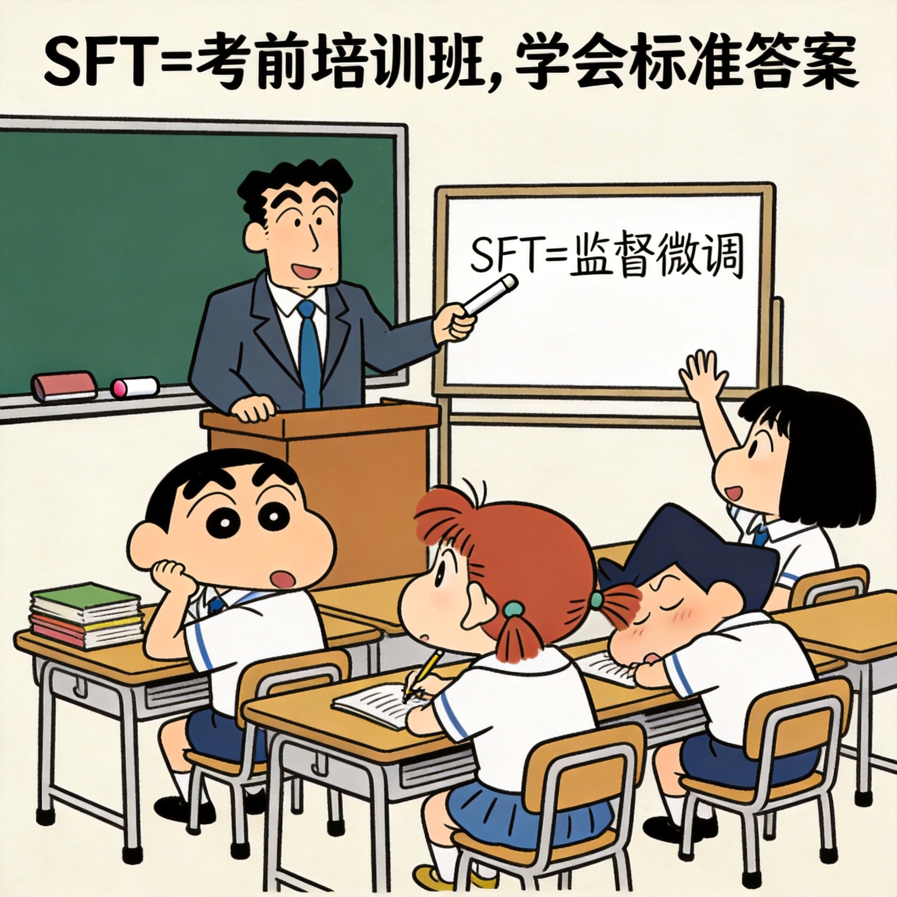
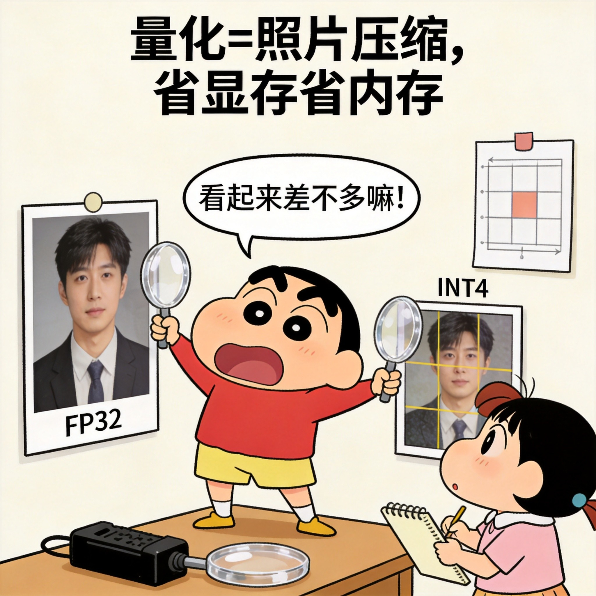
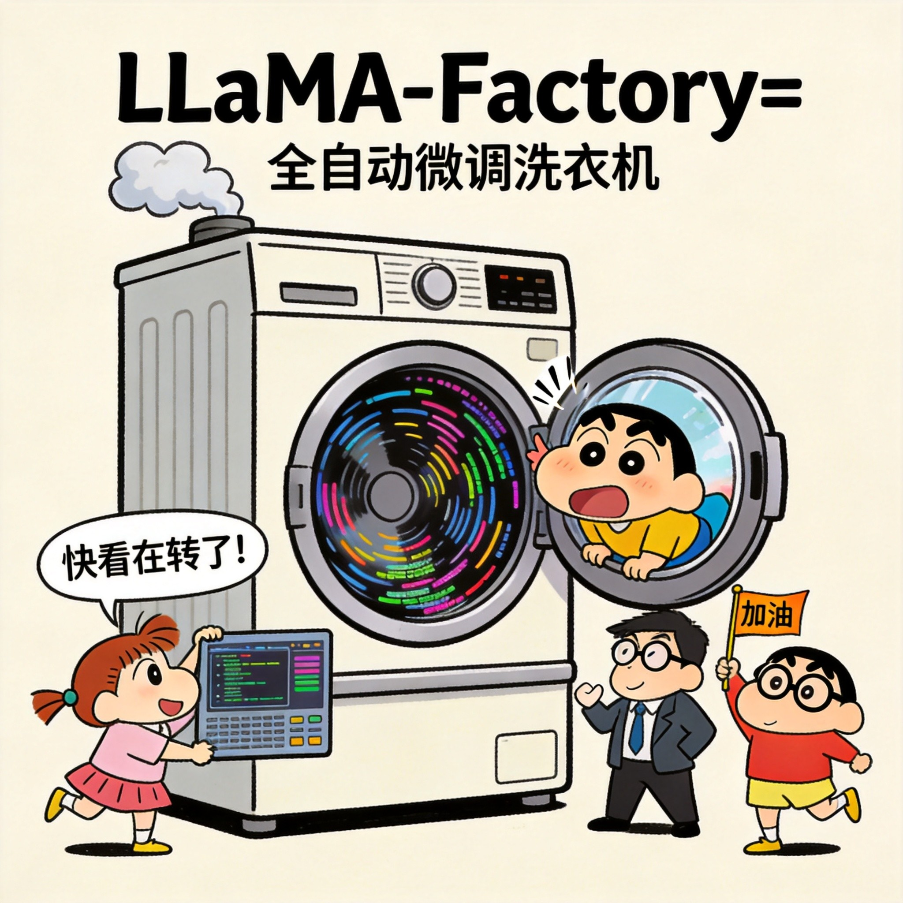

# 蜡笔小新插画 - 微调

<!-- 自动生成的插画列表 -->

### 01_什么是微调

### 02_全量微调

### 03_LoRA微调

### 04_QLoRA量化

### 05_数据准备

### 06_数据格式

### 07_数据质量

### 08_SFT监督微调

### 09_vLLM加速

### 10_Ollama部署

### 11_量化压缩

### 12_RLHF_DPO对齐

### 13_模型评估

### 14_提示工程vs微调

### 15_LLaMAFactory工具

### 16_微调成果

### 17_技术选择地图

### 18_微调性价比

